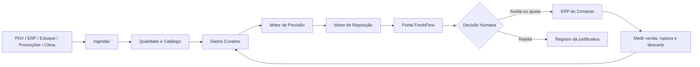
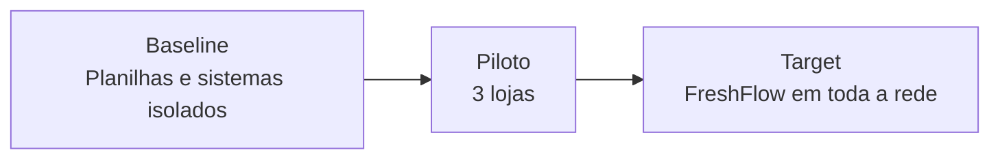

# FreshFlow — modelo arquitetural em Java

Implementação didática do modelo **Raiz Viva FreshFlow** em Java 17, baseada no modelo ArchiMate do projeto acadêmico.

O código representa de forma simples as principais camadas da arquitetura:

- Motivação e stakeholders
- Processos de negócio
- Aplicações e fontes de dados
- Tecnologia
- Roadmap TOGAF ADM
- Relações principais entre os componentes
- Transição de baseline para piloto e target

## Problema

A Raiz Viva trabalha com produtos perecíveis e enfrenta dois problemas ao mesmo tempo: **descarte por excesso** e **ruptura por falta**. A arquitetura FreshFlow propõe integrar dados hoje fragmentados para apoiar uma decisão de reposição mais rastreável.

## Fluxo principal



## Roadmap TOGAF ADM

```text
A  Visão de Arquitetura
B  Arquitetura de Negócio
C  Dados e Aplicações
D  Tecnologia
E  Oportunidades e Soluções
F  Planejamento da Migração
G  Governança da Implementação
H  Gestão de Mudanças
```

A gestão de requisitos é transversal ao ciclo.

## Estados de implementação



## Princípio central

> IA recomenda. O responsável humano aprova exceções.

Cada recomendação deve permitir rastrear o dado utilizado, versão do modelo, regra aplicada, decisão humana e resultado observado.

## Executar

Requer Java 17.

```bash
cd java-modelo-freshflow
mvn compile
java -cp target/classes br.com.fiap.freshflow.FreshFlowArchitecture
```

## Objetivo acadêmico

Este código não implementa o modelo preditivo real. Ele transforma o desenho arquitetural em uma representação Java simples e executável para facilitar a explicação do trabalho e demonstrar a relação entre negócio, dados, aplicações, tecnologia e governança.
